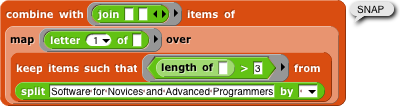
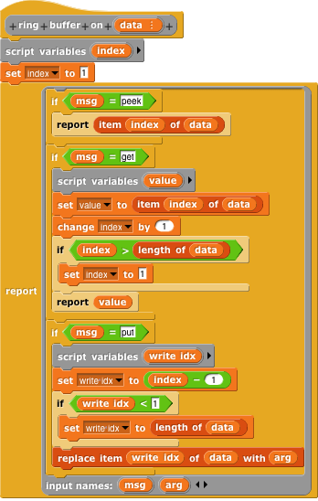
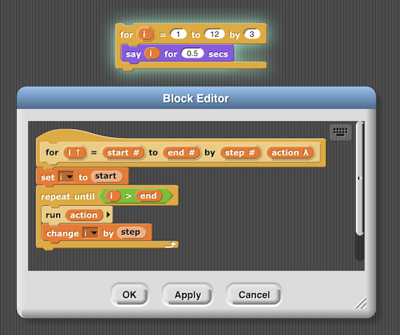
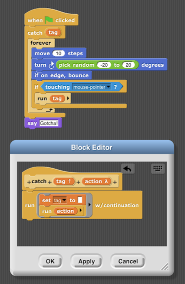
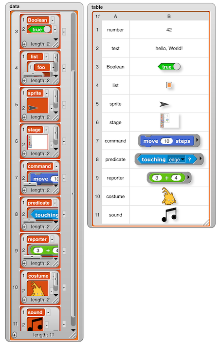
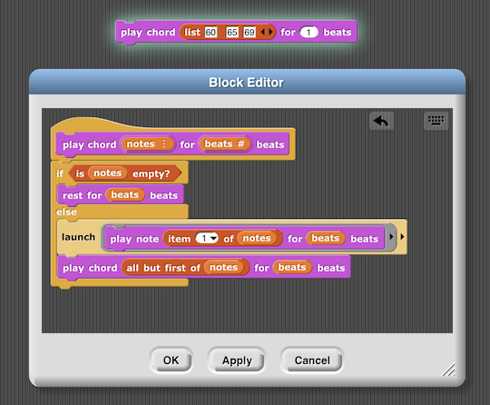
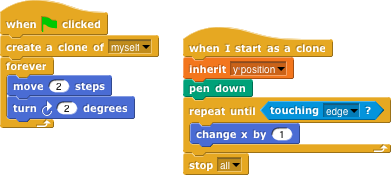
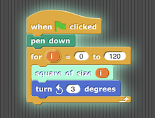

# About Snap! 

Snap! is our visual programming language. You code by stacking together graphical blocks rather than typing words. Your program is always alive, ready to be tried, tested and changed as your ideas evolve. Snap! supports imperative, functional and object oriented programming paradigms.

https://www.youtube.com/watch?v=b-EWj7xN90U

### Who uses Snap!?

Colleges and high schools use Snap! to teach computer science. Students use Snap! to create games, interactive stories, artwork and simulations, to analyze data, drill down on media, control robots and to invent new forms of expressing themselves.

### The Beauty and Joy of Computing

Snap! has been engineered to support UC Berkeley's introductory computer science curriculum named "The Beauty and Joy of Computing" (BJC).

## For Students

## For Educators

## For Parents

## For Researchers and Developers

## Snap! Concepts

> "Snap! is Scheme disguised as Scratch" 

-Brian Harvey

On the outside Snap! looks and feels just like Scratch. But inside it provides expressive concepts for abstraction otherwise only found in the most advanced and sophisticated programming languages from AI research. Snap! supports multiple programming paradigms such as imperative, structured programming, functional programming and object-oriented programming. These make Snap! suitable for an intellectually rigorous introduction to computer science at the college and high school level.

### User Defined Procedures and Functions

Snap!'s tagline is "Build Your Own Blocks". Defining custom functions is at the heart of extending any programming language. It gives you the power to add anything you want to the system. Miss a construct that you like in another programming language? Go ahead and build it in Snap!

Any kind of block that you see in Snap! you can also define yourself: Procedures (commands), functions (reporters), predicates ("Boolean inputs") and event listeners (hat blocks). Custom blocks can be defined globally ("for every sprite") or as methods of a single actor ("for this sprite only").

### Proper Tail Recursion

Recursion is a powerful idea in computing because it lets you accomplish huge tasks with only little code. Snap! encourages recursion by making it safe to use even for beginners. Technologies such as tail call optimization (TCO) and a dynamic stack ensure that you don't run out of memory in cases of deep recursion levels, and Snap!'s scaffolded scheduler lets you halt infinite recursion when you forget a base case.

Mastering recursion sets apart the computer scientists from the mere coders. With stack overflows out of the way there's nothing to stop you from inventing beautiful fractals oder recursing over large data sets.

### Lexically Scoped Variables

In addition to global and sprite-local variables Snap! also offers script-local variables, letting you factor code into reusable modules. Like in most modern programming languages Snap!'s variables are lexically scoped and support nested functions and closures. Function parameters are mutable and their value can be exposed to the caller. Snap!'s variables are dynamically typed and support heterogeneous lists.

### Lambda - First-Class Blocks

Procedures as data is another powerful idea in computing. It allows you to go meta on ideas. In addition to blocks Snap! also features "rings" around blocks transforming expressions into anonymous functions that capture their environment of origin. This lets you build your own blocks that accept other blocks and scripts as inputs, such as C-shaped control structures. You can also store blocks in lists or variables, and even make a block that returns a function (another block).

### Higher Order Functions

Snap! comes with built-in blocks that let you map, filter, enumerate and reduce data. Rather than looping over arrays these blocks take other function blocks as arguments enabling highly expressive and declarative constructs.

Higher order functions are the superpowers of computing. Snap! provides the ingredients you need to define your own uber-functions. While our pedagogy is that using higher oder functions should be easy we also believe that there should be no ceiling to what you can express in a programming language. 

### Full Closures

Snap!'s lexical scope supports an inner function to access the local variables of an outer function even after the outer function has terminated. This lets you create abstract data structures from reified dispatch procedures.

The idea that temporary local data becomes persistent for a surviving inner function lets us demystify object oriented programming.  

### User Defined Control Structures

Control structures are typically what you memorize when you learn a new programming language. Snap! lets you build your own C-shaped blocks to make your own control structures. Being able define program control in your own functions lets you discover how to make a new programming language yourself. 

### First-Class Continuations

Continuations are an advanced construct in functional programming giving you access to a part of the evaluator state. Capturing a continuation is like keeping your thumb on a certain page of a book as you close it, so later you can reopen it and continue reading where you left off. Snap!'s continuations let you build certain fancy constrol structures in Snap! itself, rather than having to write them in another programming language:

### Heterogeneous Data

Data structures are what matters most in a programming language. Data is at the heart of modelling a simulation or a digital twin. Data becomes information by adding structure and context. Snap!'s basic data structures, lists, are first-class citizens. You can assemble complex data structures out of atomic data types (numbers, text, Booleans) and combine them with other lists (lists of lists) and objects. Snap!'s lists are untyped allowing for easy heterogeneous collections of data . This lets you express any data structure you desire.

### Media Computation

Remixing pictures and sounds into interactive animations and video games through programming is hugely fun. But with Snap! we go further, letting you drill down to the bare metal of pixel and sample data to examine, manipulate and transform bits of information into new computational artefacts. Snap! not only lets you perform higher-order functions on low-level media components, it even lets you do so live on the video-feed of your webcam or the audio stream of your microphone.

### Concurrency

Snap!'s virtual machine can run many scripts for many actors (sprites) at the same time in parallel. Individual programs can be triggered by events, and if several scripts react to the same event they all run concurrently. This lets you model agent-based systems in a decentralized modular way rather than cramming everything into a single main "game loop". Snap! also lets you explicitly launch new threads programmatically, so your procecures can take advantage of parallelism to achieve complex behavior in a logical and expressive way.

### Object Oriented Programming

Bundling data structures with behavior is a powerful method to model simulations and design user interfaces. Snap!'s sprites are first-class objects. They can be directly referenced, assigned to variables and passed into functions. Sprites can have local fields ("instance variables") and custom blocks ("methods"). Objects  communicate with each other either through public "broadcasts" or through direct polymorphic messages.

Sprites can inherit local state and behavior from another. Rather than through classical inheritance Snap! supports a concrete prototypical, Lieberman-style inheritance mechanism through delegation, similar to JavaScript and SELF. 

Objects can be composed into aggregations by nesting sprites into part-whole relationships. This lets you easily create virtual puppets and robots.

### Debugging

Snap! supports debugging through a variety of data monitoring widgets, and by allowing visible "slow-mo" and single stepping. Because Snap's programs are always "live" debugging is achieved by inspecting the actual programming as it is running instead of a post-mortem stack trace.

### Extensions

Write your own JavaScript extensions. 

Web APIs, Frequency Distribution Analysis, Infinite Precision Numbers, Text-to-Speech, World Map,
JSON, CSV,  etc. etc.

